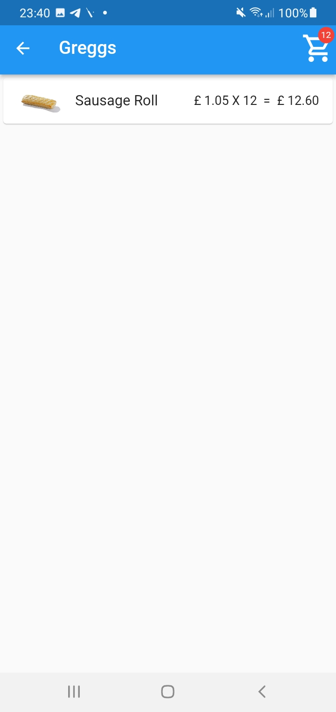

# greggs_app

NGG Greggs
Flutter Work Demonstration

## Getting Started

This project is a starting point for a Hello World flutter base example so
that it can add a Greggs Sausage Roll to a basket. 

- This will read the json file called 'data.json'.
- Then it converts the json to an object called 'Item'.

There are 3 screens in total,
    - HomeScreen
    - Item Detailed Screen 
    - Basket Screen 

- Every time you press the add buy button on the item detailed screen, an item will get added to the basket. 

- Basket screen will show all the items that has been added and the total price of them.

Screenshots of the app demo 

